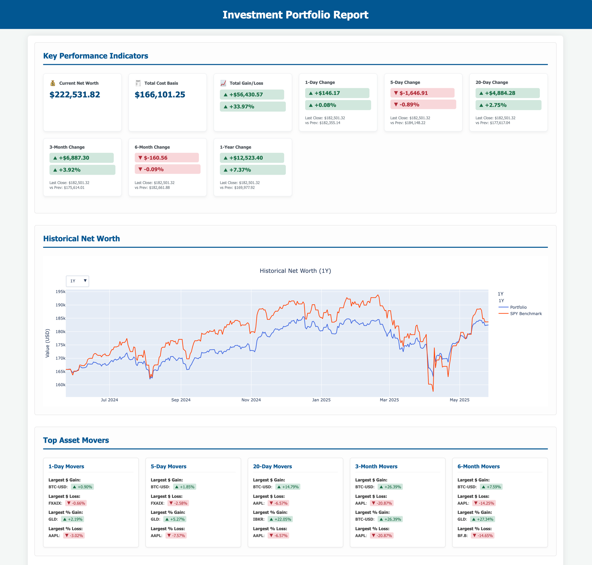

# PortfolioReporter

**Generate beautiful, interactive HTML reports for your investment portfolio!**

PortfolioReporter fetches current and historical asset data from Yahoo Finance and presents it in an easy-to-read,
modern HTML format. Get insights into your asset allocation, historical net worth compared to SPY, key performance
indicators, detailed holdings, and top asset movers.

---
*A note from the developer: This project, including its codebase and this README, was significantly bootstrapped and
developed with the assistance of Google's Gemini 2.5 Pro.*
---



<!-- Make sure doc/image.png exists and is a good representation -->

## Features

* **Interactive Charts:** Asset allocation (by type, sector) and historical net worth charts (vs. SPY benchmark) powered
  by Plotly.
* **Key Performance Indicators (KPIs):** At-a-glance view of current net worth, total cost basis, total gain/loss, and
  period changes (1-day, 5-day, 20-day, 3-month, 6-month, 1-year).
* **Detailed Holdings Table:** Sortable and filterable table of all your assets, powered by DataTables.js.
* **Aggregated Summaries:** Tables summarizing your portfolio by symbol and by a heuristic risk level.
* **Top Asset Movers:** See which assets had the most significant impact (dollar and percentage) over various periods.
* **Flexible Data Input:** Use a CSV file for your portfolio data or run with sample data.
* **Smart Data Caching:** Fetched asset information and historical prices are cached locally to speed up subsequent
  report generations.
* **Interactive Symbol Mapping:** If an asset symbol isn't found or data is problematic, the tool prompts you to map it
  to a valid symbol (or treat as cash/ignore) and remembers your choice.
* **Modern HTML Output:** Clean, responsive HTML report viewable in any web browser.

## Getting Started with `uv` (Recommended)

This project is best managed using `uv`, a fast Python package installer and resolver from Astral.

### Prerequisites

* **Python:** Version 3.8 or higher. Download from [python.org](https://www.python.org/downloads/).
* **uv:** Install `uv` by following the instructions at [astral.sh/uv](https://astral.sh/uv).
    * For example, on macOS/Linux: `curl -LsSf https://astral.sh/uv/install.sh | sh`

### Installation & Setup

1. **Clone the Repository:**
   ```bash
   git clone https://github.com/jianlingzhong/PortfolioReporter.git
   cd PortfolioReporter
   ```

2. **Create and Activate a Virtual Environment using `uv`:**
   It's highly recommended to use a virtual environment for Python projects to manage dependencies in isolation.
   ```bash
   uv venv .venv  # Creates a virtual environment named '.venv' in your project directory
   source .venv/bin/activate  # On macOS/Linux
   # For Windows PowerShell: .\.venv\Scripts\Activate.ps1
   # For Windows Command Prompt: .\.venv\Scripts\activate.bat
   ```
   You should see `(.venv)` at the beginning of your terminal prompt, indicating the environment is active.

3. **Install Dependencies using `uv`:**
   The required Python packages are defined in the `pyproject.toml` file. `uv` can install them directly.

    * **Preferred method with `uv`:**
      ```bash
      uv sync 
      ```
      This command synchronizes your virtual environment with the dependencies specified in `pyproject.toml`, ensuring
      an exact match.

    * **Alternative `uv` method:**
      ```bash
      uv pip install .
      ```
      This command also installs dependencies based on `pyproject.toml`.
    * The minimal content for `requirements.txt` would be:
      ```
      pandas
      yfinance
      plotly
      Jinja2
      requests
      numpy
      ```

## Usage

The main script to generate the report is `main_reporter.py`.

1. **Prepare Your Portfolio Data CSV (Optional but Recommended):**
   Create a CSV file (e.g., `assets.csv` - a sample is provided in the repository) with the following columns:
    * `Account`: The name of the account (e.g., "Brokerage", "Retirement 401k").
    * `Symbol`: The stock/ETF/mutual fund ticker symbol (e.g., "AAPL", "VOO", "FXAIX"). Use "CASH" for cash holdings.
      Symbol lookups are case-insensitive (e.g., "aapl" is treated as "AAPL").
    * `Amount`: The number of shares or units you hold. For cash, this is the dollar amount.
    * `Cost`: The total cost basis for that holding. For cash, this is usually 0.

   **Example `assets.csv` row:**
   ```csv
   Brokerage Account,MSFT,15,"$2,500.75" 
   ```
   The script can handle currency symbols ($) and commas (,) in 'Amount' and 'Cost' columns.

2. **Run the Script (using `uv run`):**
   Ensure your `uv` virtual environment is active.

    * **To use the default sample data embedded in the script:**
      ```bash
      uv run main_reporter.py
      ```

    * **To use your CSV input file (e.g., `assets.csv` in the project root):**
      ```bash
      uv run main_reporter.py -i assets.csv
      ```
      Or specify a full path: `uv run main_reporter.py -i path/to/your/assets.csv`

    * **Command-Line Options:**
        * `-i FILE` or `--input-file FILE`: Specifies the path to your portfolio CSV file.
        * `--rebuild-cache`: Ignores any existing cached data and fetches fresh data from APIs for this run. The cache
          will be updated with the new data.
        * `--non-interactive`: Disables interactive prompts for unknown or problematic symbols. The script will use
          fallbacks (like $0 value) or skip these symbols without asking.

   **Example with all options:**
   ```bash
   uv run main_reporter.py -i assets.csv --rebuild-cache --non-interactive
   ```

3. **View the Report:**
   After the script finishes, it will generate `portfolio_report.html` in the project directory and attempt to open it
   in your default web browser.

## Handling Problematic Symbols (Interactive Mapping)

When the tool encounters a symbol it cannot find data for (e.g., typo, delisted, non-standard ticker), it will prompt
you (unless `--non-interactive` is used):

```
----------------------------------------
WARNING:root:DATA FETCH FAILED for symbol: 'NONEXISTENT' (context: current details)
Could not automatically fetch data for symbol: 'NONEXISTENT'
This symbol might be incorrect, delisted, or require a specific format (e.g., 'BRK-B' instead of 'BRK.B').
You can provide an alternative mapping for this session and future runs:
1. Enter a VALID Yahoo Finance ticker to use as a proxy (e.g., VTI, SPY).
2. (If proxy) Enter a price factor (e.g., 1.0 if direct proxy, 0.1 if proxy is 10x value).
3. Enter 'cash' to treat this symbol as a cash equivalent (price 1.0).
4. Enter 'ignore' or just press Enter to skip this symbol (will assign 0 value).
   Proxy symbol for 'NONEXISTENT' (or 'cash'/'ignore'/Enter):
```

**How to Respond:**

* **Option 1 & 2: Proxy Symbol and Price Factor**
    * **Proxy Symbol:** If `NONEXISTENT` actually represents an asset similar to `VOO`, you would type `VOO`.
    * **Price Factor:**
        * If the price of `NONEXISTENT` is directly comparable to `VOO` (i.e., 1 share of `NONEXISTENT` should have the
          value of 1 share of `VOO`), enter `1.0` (or just press Enter for the default of 1.0).
        * If, for example, your `NONEXISTENT` asset is priced such that 1 unit of it is equivalent to 0.5 units of
          `VOO`, you would enter `0.5` as the price factor.
        * If `NONEXISTENT` was a stock that split 2-for-1 and `VOO` is your proxy before considering the split, and you
          want `NONEXISTENT`'s price to be `VOO_price * 2`, you'd enter `2.0`.
        * **Essentially, the price factor is: `(Actual Price of Original Symbol) / (Price of Proxy Symbol)`**
          The tool will calculate: `Value_Original = Amount_Original * (Price_Proxy * Price_Factor)`

* **Option 3: `cash`**
    * Type `cash`. This will treat the symbol like your other "CASH" entries, with a price of $1.00 per unit of
      `Amount`. Useful for money market funds not in `CASH_EQUIVALENT_SYMBOLS` or other stable value assets.

* **Option 4: `ignore` or Enter**
    * If you type `ignore` or simply press Enter, the symbol will be treated as having a $0 value for the current
      report. The tool will also remember *not to ask you again* for this symbol in future runs (unless
      `--rebuild-cache` is used or you manually clear the mapping cache). This is useful for symbols you genuinely want
      to exclude.

Your choices are saved in `.cache/symbol_mappings/user_symbol_mappings.json` and will be reused in subsequent runs,
saving you from repeated prompts.

## Cache Management

* **Location:** `.cache/` directory in the project root.
    * `asset_info/`: Caches details like name, type, sector.
    * `historical_prices/`: Caches daily price data.
    * `symbol_mappings/`: Stores your interactive mapping choices.
* **Purpose:** Speeds up report generation significantly after the first run.
* **Rebuilding:** Use `--rebuild-cache` to force a refresh of API-fetched data (asset info and historical prices).
  Symbol mappings you've made will still be respected unless the mapped-to symbol also fails.
* **Clearing:** Manually delete the entire `.cache` directory to clear all cached data and mappings.

## Customization & Extending

* **Risk Levels:** Modify `determine_risk_level` in `portfolio_analyzer/data_processing.py`.
* **Cash Equivalents:** Expand the `CASH_EQUIVALENT_SYMBOLS` set in `portfolio_analyzer/data_processing.py`.
* **New Report Sections:** Add builder functions in `portfolio_analyzer/section_builders.py`, call them in
  `main_reporter.py`, and update `templates/report_template.html`.
* **Styling:** Edit the `<style>` section in `templates/report_template.html`.

## Contributing

Contributions are welcome! Please fork the repository, make your changes, and submit a pull request. For major changes,
consider opening an issue first.

## License

This project is licensed under the MIT License. See the `LICENSE.txt` file for details.
<!-- TODO: Create a LICENSE.txt file with the MIT license text -->
