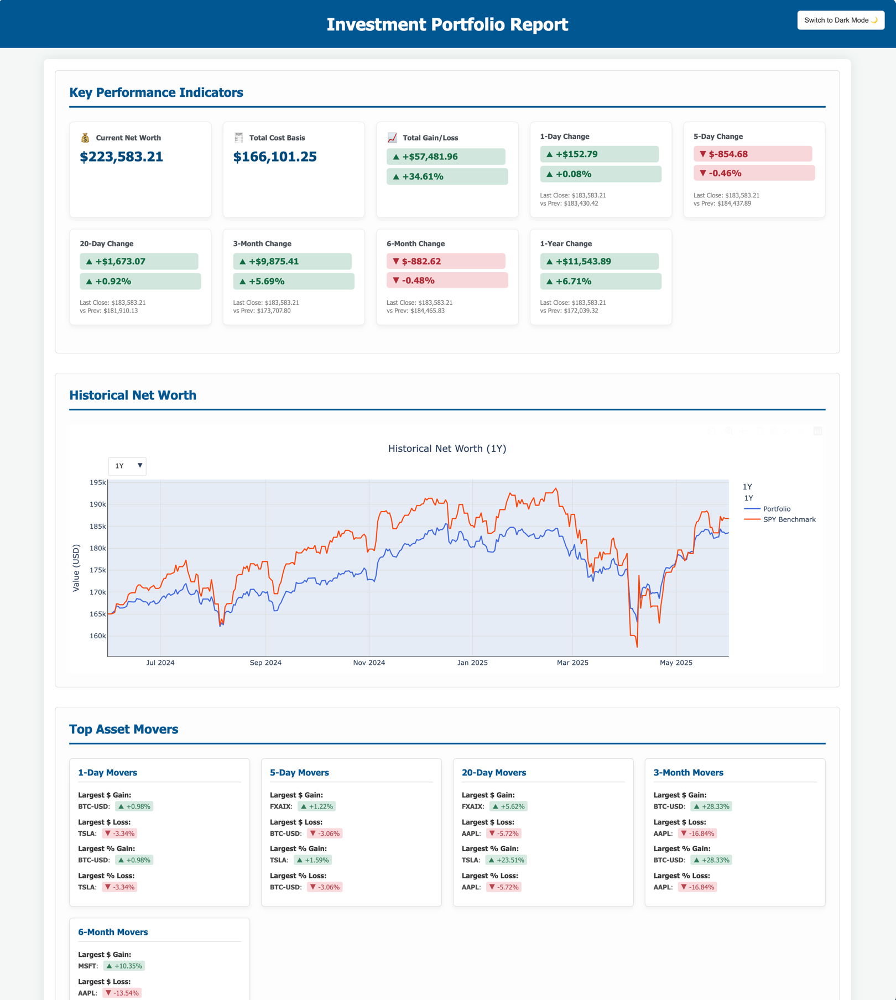

# PortfolioReporter

**Generate beautiful, interactive HTML reports for your investment portfolio!**

PortfolioReporter fetches current and historical asset data from Yahoo Finance and presents it in an easy-to-read,
modern HTML format. Get insights into your asset allocation, historical net worth compared to SPY, key performance
indicators, detailed holdings, and top asset movers.

---
*A note from the developer: This project, including its codebase and this README, was significantly bootstrapped and
developed with the assistance of Google's Gemini 2.5 Pro.*
---



<!-- Make sure doc/img.png exists and is a good representation -->

## Features

*   **Interactive Historical Chart:** Visualize your portfolio's historical net worth against a SPY benchmark, powered by Plotly.
*   **Interactive Drill-Down Tables:** Get high-level summaries of your portfolio by Symbol, Risk Level, and Asset Class. Click on any summary row to instantly drill down and see the specific holdings that make up that category.
*   **Key Performance Indicators (KPIs):** At-a-glance view of current net worth, total cost basis, total gain/loss, and period changes (1-day, 5-day, 20-day, 3-month, 6-month, 1-year).
*   **Detailed Holdings Table:** A sortable and filterable master table of all your assets, showing individual cost basis, market value, gain/loss, and asset class details, powered by DataTables.js.
*   **Top Asset Movers:** See which assets had the most significant impact (dollar and percentage) over various periods.
*   **Flexible Data Input:** Use a CSV file for your portfolio data. The importer is smart enough to recognize common column headers like `ticker`, `quantity`, and `cost basis`.
*   **Smart Data Caching:** Fetched asset information and historical prices are cached locally to speed up subsequent report generations.
*   **Interactive Symbol Mapping:** If an asset symbol isn't found (e.g., a typo, CUSIP, or delisted ticker), the tool prompts you to map it to a valid symbol and remembers your choice for future runs.
*   **Modern HTML Output:** Clean, responsive HTML report with a dark/light mode theme toggle, viewable in any modern web browser.

## Getting Started with `uv` (Recommended)

This project is best managed using `uv`, a fast Python package installer and resolver from Astral.

### Prerequisites

*   **Python:** Version 3.10 or higher. Download from [python.org](https://www.python.org/downloads/).
*   **uv:** Install `uv` by following the instructions at [astral.sh/uv](https://astral.sh/uv).
    *   For example, on macOS/Linux: `curl -LsSf https://astral.sh/uv/install.sh | sh`

### Installation & Setup

1.  **Clone the Repository:**
    ```bash
    git clone https://github.com/jianlingzhong/PortfolioReporter.git
    cd PortfolioReporter
    ```

2.  **Create and Activate a Virtual Environment using `uv`:**
    It's highly recommended to use a virtual environment for Python projects to manage dependencies in isolation.
    ```bash
    uv venv .venv  # Creates a virtual environment named '.venv' in your project directory
    source .venv/bin/activate  # On macOS/Linux
    # For Windows PowerShell: .\.venv\Scripts\Activate.ps1
    # For Windows Command Prompt: .\.venv\Scripts\activate.bat
    ```
    You should see `(.venv)` at the beginning of your terminal prompt, indicating the environment is active.

3.  **Install Dependencies using `uv`:**
    The required Python packages are defined in the `pyproject.toml` file. The `uv sync` command is the preferred way to install them as it ensures your environment exactly matches the project's lock file.

    ```bash
    uv sync
    ```

## Usage

The main script to generate the report is `main_reporter.py`.

1.  **Prepare Your Portfolio Data CSV (Optional but Recommended):**
    Create a CSV file (e.g., `assets.csv` - a sample is provided in the repository) with the following columns. The script is flexible with column names (e.g., it recognizes `Symbol`, `ticker`, `Amount`, `quantity`, `Cost`, `cost basis`, etc.).
    *   `Account`: The name of the account (e.g., "Brokerage", "Retirement 401k").
    *   `Symbol`: The stock/ETF/mutual fund ticker symbol (e.g., "AAPL", "VOO", "FXAIX"). Use "CASH" for cash holdings. Symbol lookups are case-insensitive.
    *   `Amount`: The number of shares or units you hold. For cash, this is the dollar amount.
    *   `Cost`: The total cost basis for that holding. For cash, this is usually 0.

    **Example `assets.csv` row:**
    ```csv
    Brokerage Account,MSFT,15,"$2,500.75"
    ```
    The script can handle currency symbols ($) and commas (,) in 'Amount' and 'Cost' columns.

2.  **Run the Script (using `uv run`):**
    Ensure your `uv` virtual environment is active. `uv run` is a convenient way to execute scripts within the managed environment.

    *   **To use the default sample data embedded in the script:**
        ```bash
        uv run main_reporter.py
        ```

    *   **To use your CSV input file (e.g., `assets.csv` in the project root):**
        ```bash
        uv run main_reporter.py -i assets.csv
        ```
        Or specify a full path: `uv run main_reporter.py -i path/to/your/assets.csv`

    *   **Command-Line Options:**
        *   `-i FILE` or `--input-file FILE`: Specifies the path to your portfolio CSV file.
        *   `--rebuild-cache`: Ignores any existing cached data and fetches fresh data from APIs for this run. The cache will be updated with the new data.
        *   `--non-interactive`: Disables interactive prompts for unknown or problematic symbols. The script will use fallbacks (like $0 value) or skip these symbols without asking.

    **Example with all options:**
    ```bash
    uv run main_reporter.py -i assets.csv --rebuild-cache --non-interactive
    ```

3.  **View the Report:**
    After the script finishes, it will generate `portfolio_report.html` in the project directory and attempt to open it in your default web browser.

## Handling Problematic Symbols (Interactive Mapping)

When the tool encounters a symbol it cannot find data for (e.g., typo, delisted, non-standard ticker), it will prompt you (unless `--non-interactive` is used):

```
----------------------------------------
WARNING:root:DATA FETCH FAILED for symbol: 'NONEXISTENT' (context: current details)
Could not automatically fetch data for symbol: 'NONEXISTENT'
This might be an incorrect ticker, a delisted asset, or a non-ticker identifier.
Examples include CUSIPs (like '31617E471'), or internal fund numbers.

You can provide an alternative mapping for this session and future runs:
1. Enter a VALID Yahoo Finance ticker to use as a proxy (e.g., VTI, SPAXX).
2. (If proxy) Enter a price factor (e.g., 1.0 if direct proxy, 0.1 if proxy is 10x value).
3. Enter 'cash' to treat this symbol as a cash equivalent (price 1.0).
4. Enter 'ignore' or just press Enter to skip this symbol (will assign 0 value).
   Proxy symbol for 'NONEXISTENT' (or 'cash'/'ignore'/Enter):
```

**How to Respond:**

*   **Option 1 & 2: Proxy Symbol and Price Factor**
    *   **Proxy Symbol:** If `NONEXISTENT` actually represents an asset similar to `VOO`, you would type `VOO`.
    *   **Price Factor:**
        *   If the price of `NONEXISTENT` is directly comparable to `VOO` (i.e., 1 share of `NONEXISTENT` should have the value of 1 share of `VOO`), enter `1.0` (or just press Enter for the default of 1.0).
        *   If, for example, your `NONEXISTENT` asset is priced such that 1 unit of it is equivalent to 0.5 units of `VOO`, you would enter `0.5` as the price factor.
        *   **Essentially, the price factor is: `(Actual Price of Original Symbol) / (Price of Proxy Symbol)`**
            The tool will calculate: `Value_Original = Amount_Original * (Price_Proxy * Price_Factor)`

*   **Option 3: `cash`**
    *   Type `cash`. This will treat the symbol like your other "CASH" entries, with a price of $1.00 per unit of `Amount`. Useful for money market funds or other stable value assets.

*   **Option 4: `ignore` or Enter**
    *   If you type `ignore` or simply press Enter, the symbol will be treated as having a $0 value for the current report. The tool will also remember *not to ask you again* for this symbol in future runs (unless `--rebuild-cache` is used or you manually clear the mapping cache).

Your choices are saved in `.cache/symbol_mappings/user_symbol_mappings.json` and will be reused in subsequent runs, saving you from repeated prompts.

## Cache Management

*   **Location:** `.cache/` directory in the project root.
    *   `asset_info/`: Caches details like name, type, sector.
    *   `historical_prices/`: Caches daily price data.
    *   `symbol_mappings/`: Stores your interactive mapping choices.
*   **Purpose:** Speeds up report generation significantly after the first run.
*   **Rebuilding:** Use `--rebuild-cache` to force a refresh of API-fetched data (asset info and historical prices). Symbol mappings you've made will still be respected unless the mapped-to symbol also fails.
*   **Clearing:** Manually delete the entire `.cache` directory to clear all cached data and mappings.

## Customization & Extending

*   **Risk Levels:** Modify `determine_risk_level` in `portfolio_analyzer/data_processing.py`.
*   **Asset Classes:** Modify `determine_asset_class` in `portfolio_analyzer/data_processing.py` to change how your assets are categorized.
*   **Cash Equivalents:** Expand the `CASH_EQUIVALENT_SYMBOLS` set in `portfolio_analyzer/data_processing.py`.
*   **New Report Sections:** Add builder functions in `portfolio_analyzer/section_builders.py`, call them in `main_reporter.py`, and update `templates/report_template.html`.
*   **Styling:** Edit the `<style>` section in `templates/report_template.html`.

## Contributing

Contributions are welcome! Please fork the repository, make your changes, and submit a pull request. For major changes, consider opening an issue first.

## License

This project is licensed under the MIT License. See the `LICENSE.txt` file for details.
<!-- TODO: Create a LICENSE.txt file with the MIT license text -->